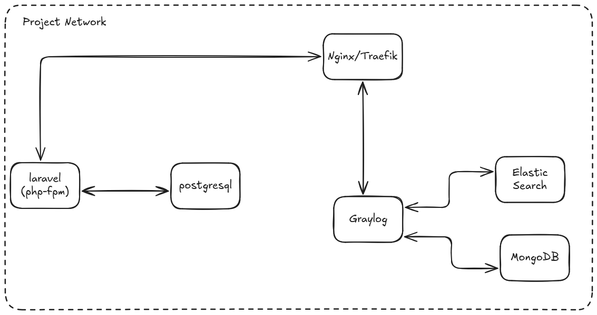
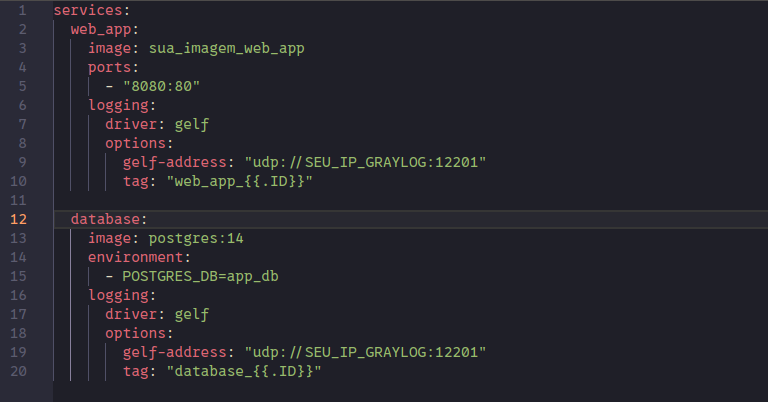

# Desafio SCS DEVOPS

Nesta atividade, você será desafiado a construir, passo a passo, uma infraestrutura completa em containers Docker para uma aplicação Laravel. O objetivo é compreender, de forma prática, como diferentes serviços se comunicam dentro de um ambiente isolado e reproduzível, além de introduzir o conceito de observabilidade através da centralização de logs.

[](./assets/arquitetura.png)

## Sumário

- [Desafio SCS DEVOPS](#desafio-scs-devops)
  - [Sumário](#sumário)
  - [Visão geral](#visão-geral)
  - [1. Crie a stack Laravel](#1-crie-a-stack-laravel)
  - [2. Adicione o Reverse Proxy](#2-adicione-o-reverse-proxy)
  - [3. Suba a stack Graylog](#3-suba-a-stack-graylog)
  - [4. Envie os logs](#4-envie-os-logs)
  - [5. Observações](#5-observações)
  - [6. Extra:](#6-extra)
  - [7. Resultado Esperado](#7-resultado-esperado)
  - [Pré-requisitos](#pré-requisitos)
  - [Como testar / verificar](#como-testar--verificar)
  - [Logging e Graylog](#logging-e-graylog)
  - [Dicas e troubleshooting](#dicas-e-troubleshooting)
  - [Checklist de entrega](#checklist-de-entrega)

## Visão geral

Você irá:

1. **Containerizar uma aplicação Laravel**, utilizando PHP-FPM e PostgreSQL;
2. **Servir a aplicação por meio de um reverse proxy** (Nginx ou Traefik), que será o único ponto de entrada da stack;
3. **Configurar a stack do Graylog** (com MongoDB e Elasticsearch) para **coletar e centralizar logs** de todos os containers;
4. **Ajustar o Laravel e o PHP-FPM** para que os logs da aplicação também sejam enviados para o Graylog.

---

## 1. Crie a stack Laravel

- Container laravel (base: php:8.2-fpm-alpine)
- Container nginx (para servir o Laravel)
- Container postgres (banco de dados)
- Teste o acesso local (curl http://localhost → retorna página Laravel)

## 2. Adicione o Reverse Proxy

- Pode ser Nginx ou Traefik.
- Redirecionar localhost:8080 → container nginx.
- Expor apenas o proxy para o host.
- Adicionar labels no docker-compose.yml se usar Traefik.

## 3. Suba a stack Graylog

- Containers:
  - graylog
  - mongodb
  - elasticsearch (alternativamente, pode-se usar o datanode do Graylog)
- Graylog disponível em http://localhost:9000
- Crie um input do tipo GELF UDP na porta 12201.

## 4. Envie os logs

- Configure o container nginx e laravel para enviar logs via GELF.

## 5. Observações

- Configure volumes onde achar necessário (ex: `/var/lib/postgresql/data`, `/var/lib/elasticsearch/data`, etc.).
- Todos os containers devem estar na mesma network (project_network).
- Use .env para armazenar credenciais e configurações sensíveis.

## 6. Extra:

Por padrão, o php-fpm não inclui os logs da aplicação Laravel no stdout do container.

**Desafio extra: altere a configuração de logging do Laravel:**

- Em `config/logging.php`, mude o driver de stack para errorlog:
    ```php
    default => env('LOG_CHANNEL', 'errorlog'),
    ```

## 7. Resultado Esperado

Ao final do desafio:

- A aplicação Laravel responde em http://localhost:8080
- Todos os containers estão acessíveis via docker ps
- Logs centralizados aparecem no Graylog
- Nenhum container expõe portas desnecessárias

**Dicas:**

1. Exemplo de envio de logs pro graylog via docker-compose:



2. [Como pegar os logs do Laravel no php fpm?](https://stackoverflow.com/questions/55254973/how-can-i-get-logs-of-laravel-in-docker-behind-php-fpm)
3. [Configurando o laravel com o nginx como proxy reverso](https://www.digitalocean.com/community/tutorials/how-to-set-up-laravel-nginx-and-mysql-with-docker-compose)
4. [Centralizando logs com Graylog](https://tweaks.com/easy-log-centralization-with-graylog-and-docker/)

## Pré-requisitos

- Docker >= 20.x e Docker Compose (ou Docker Compose V2 integrado)
- Git (para clonar repositórios ou exemplos)
- Porta 8080 e 9000 livres (ou ajustar variáveis no compose)


## Como testar / verificar

- Verificar que a aplicação responde:

```bash
curl -I http://localhost:8080
# ou abrir no navegador http://localhost:8080
```

- Verificar Graylog:

Abra http://localhost:9000 e confirme que o input GELF UDP (porta 12201) está ativo.

## Logging e Graylog

- Recomenda-se configurar o Laravel para enviar logs via `errorlog` (PHP) e configurar o syslog/nginx para encaminhar via GELF para o Graylog.
- No Graylog, crie um input GELF UDP na porta 12201 e confirme que mensagens chegam.


[](./assets/exemplo_logs.png)

## Dicas e troubleshooting

- Se a aplicação retornar 500, cheque `docker compose logs -f laravel` e `docker compose logs -f nginx`.
- Se o Graylog não receber mensagens: verifique se o input GELF UDP está criado e se a porta 12201 está exposta apenas na network do Docker.
- Erros comuns com Elasticsearch: aumente memória se necessário (vars do compose) e confirme volumes para persistência.

Comandos úteis:

```bash
# listar containers
docker ps

# ver logs de um container específico
docker logs -f <container>

# entrar no container (ex: para debug)
docker compose exec laravel sh
```

## Checklist de entrega

- [ ] Laravel em execução e acessível em http://localhost:8080
- [ ] Reverse proxy configurado e expõe apenas a porta do proxy
- [ ] Graylog, MongoDB e Elasticsearch em execução
- [ ] Logs da aplicação enviados ao Graylog
- [ ] Volumes configurados para persistência

